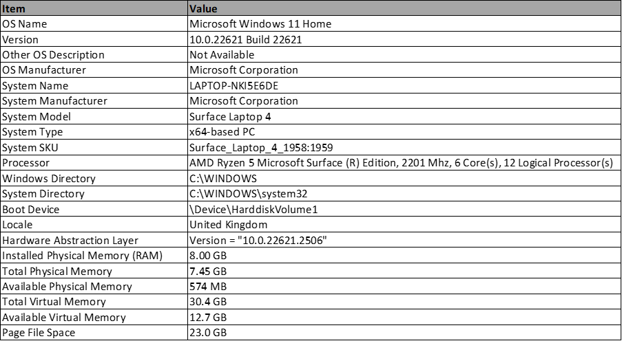

# Unstructured Data Analysis Final Project
_Imperial College London - Machine Learinging and Data Science_

## Problem Statement
- Train a Convolutional Neural Network classifier for fire image classification.
- Investigate the effect of the preprocessing, hidden and output layers of the trained CNN model on an example image.
- Evaluate the Accuracy, Precision and Recall of the model on Validation, Testing and Out-of-Sample images.

## Repository Contents

- `~/data/`
    - `FLAME_Dataset_subset/`: A 100MB subset of the 1.46GB FLAME Dataset used for model training in sample testing
    - `create_data_subset.ipynb`: Python script used to create the subset of the larger FLAME dataset
    - `Kaggle FIRE dataset/`: A dataset used for out of sample testing
- `~/figures/`: Figures exported and saved throughout the analysis, and used in the main report.
- `~/latex_report/`
    - `UDA_FinalProject_Batek.pdf`: The PDF report to be submitted on Coursera.
    - `UDA_FinalProject_Batek.tex`: LaTeX script used to compile the PDF report.
- `~/models/`:
    - `dcnn_model_checkpoints/`: Directory containing model copies saved after each epoch during training.
    - `dcnn_model_training.hist`: A Python Dictionary containing the training metrics (TP, FP, TN, FN, Accuracy, Precision, Recall, AUC for Training and Validation) for each epoch during training.
    - `dcnn_model.keras`: A trained Xception Classifier model, trained using the entire 1 GB FLAME Training set
    - `dcnn_model_simple.keras`: A trained Xception Classifier model, trained using only the training data from `~/data/FLAME_Dataset_subset/`
- `~/reference_material/`: Directory contained reference article PDFs and the `references.bib` file for the assignment.
- `~/scripts/`: __Directory containing the assignment script__ `UDA_FinalProject_Batek.ipynb`

## Technical Specifications

### Hardware
The project was compiled exclusively on my Miscrosoft Surface Laptop 4, which has the following specifications:



### Dependencies
Please consult the `environment.yml`, `requirement.txt` and `spec-file.txt` for a specific list detailing the Python environment dependencies. The key dependencies are:
- Python v3.7.12
- Tensorflow v2.3.0
- Keras v2.4

The list above is not exhaustive - please refer to the aforementioned files if necessary. To replicate the python environment, execute:
```
conda create --name <env_name> --file spec-file.txt
```
with `conda` or
```
pip install -r requirements.txt
```
after creating and activating a virtual environment with `virtualenv`

## Instructions

The Python Notebook containing the code for the assignment is located in `~/scripts/UDA_FinalProject_Batek.ipynb`